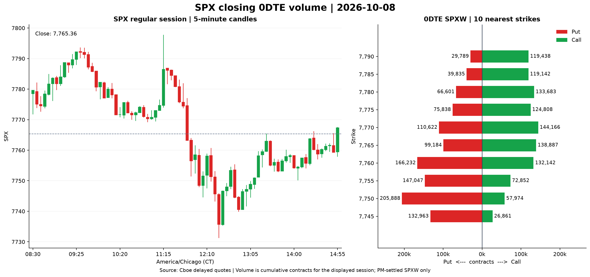
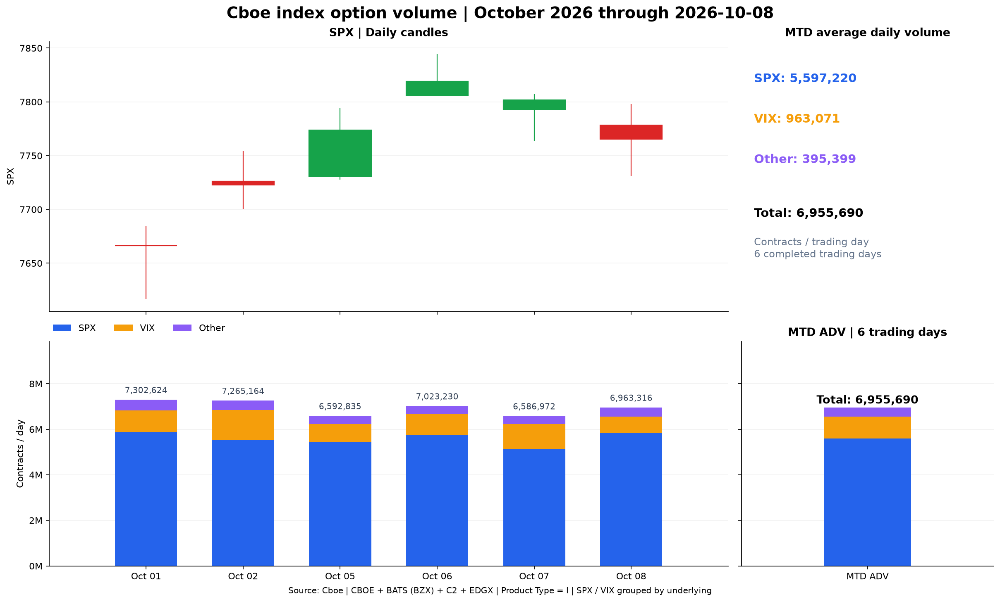

# Cboe SPX Reports

Generate two daily market charts from public Cboe data: SPX closing 0DTE
put/call volume and month-to-date index option volume across all four Cboe
options exchanges. On Windows, double-click the included batch files, or run
the Python tools directly. A portable agent skill is also included.

No API key is required. Dates use **America/Chicago (CT)**, including daylight
saving time. Every successful run replaces its fixed output file.

## Sample charts

Generated on October 9, 2026 (CT), using the completed October 8 session.
These saved examples stay unchanged when you generate new reports locally.

### SPX closing 0DTE — October 8, 2026



### Cboe index option volume — October 2026 through October 8



## Reports

| Command | Suggested run time (CT) | Output |
| --- | --- | --- |
| `zero-dte` | 8:00 PM | `spx_0dte.png` |
| `index-mtd` | 9:00 AM | `cboe_index_mtd.png` |

### SPX closing 0DTE volume

- Left panel: SPX regular-session five-minute candlesticks, green for up and
  red for down, with a reference line at the official daily close.
- Right panel: the displayed session's cumulative put/call contract volume at
  the **10 total strikes nearest the close**. Puts extend left in red and calls right in green,
  with equal scales about zero and numeric volume labels.
- Only the requested day's PM-settled **SPXW** contracts qualify. AM-settled
  standard SPX contracts are excluded because they stopped trading earlier.
- Use `--strikes N` to change the number of displayed strikes.
- By default, choose the latest trading session whose cash close plus the
  20-minute delayed-data window has passed. Before today's close, just after
  midnight, and on weekends or holidays, use the previous completed session.
  For example, a run at 00:03 CT on October 9 still reports October 8 when Cboe
  retains its candles and expired chain. The chart and JSON identify that date.

### Cboe index option MTD volume

- Target period: the month containing **yesterday's CT calendar date**, from
  its first trading day through yesterday. A run on November 1 reports October.
- Fetch all symbols on **CBOE, BATS (BZX), C2, and EDGX**, then retain only
  records whose `Product Type` is `I`.
- Group by exact underlying into **SPX**, **VIX**, and **Other**. SPXW and
  adjusted SPX classes belong to SPX; VIXW belongs to VIX. All other index
  underlyings are automatically combined into Other.
- Plot SPX daily candlesticks above stacked option volume, ordered from the
  base upward as SPX, VIX, Other.
- A separate stacked bar displays **MTD average daily volume (ADV)**, with a
  numeric label for each group and the total. Its bar shares the daily volume
  panel's y-axis, scale, height, and zero baseline for direct comparison.

Each group's ADV is its MTD contract total divided by the **same number of
trading days** in the target period. Weekends and holidays do not enter the
denominator; zero-volume days for a group do.

## Quick start

Requirements: Python **3.11 or newer** and network access to Cboe's public
website and CDN. Run these commands from the repository root.

### Windows: double-click to run

After completing the Windows environment setup below, double-click either file
in the repository root:

| Batch file | Report | Output in repository root |
| --- | --- | --- |
| [`run_zero_dte.bat`](run_zero_dte.bat) | Latest completed SPX session's 0DTE volume | `spx_0dte.png` |
| [`run_index_mtd.bat`](run_index_mtd.bat) | Index option MTD volume and ADV | `cboe_index_mtd.png` |

Both use this repository's `.venv\Scripts\python.exe`, locate the repository
relative to the batch file, and write output to its root regardless of the
launching directory. Dates still use America/Chicago. No scheduler is installed
or required; click whenever you want a fresh report.

On success, the new PNG opens in your default image viewer. The window shows
the actual session date or MTD period, plus SPX, VIX, Other, and total MTD ADV
for the morning report, and stays open until you press a key. On a skip or
failure it shows the reason and does not open a previous image. If `.venv` is
missing, it asks you to complete the setup below. If Windows has no working
PNG viewer, the generated image remains available in the repository root.

### Windows PowerShell

```powershell
python -m venv .venv
.\.venv\Scripts\python.exe -B -m pip install --no-cache-dir -r requirements.txt
.\.venv\Scripts\python.exe -B tools/spx_reports.py zero-dte
.\.venv\Scripts\python.exe -B tools/spx_reports.py index-mtd
```

### macOS / Linux

```sh
python3 -m venv .venv
.venv/bin/python -B -m pip install --no-cache-dir -r requirements.txt
.venv/bin/python -B tools/spx_reports.py zero-dte
.venv/bin/python -B tools/spx_reports.py index-mtd
```

The resulting PNGs are written to the current working directory. Use
`--output-dir reports` to put them in a dedicated directory.

## Command options

```text
spx_reports.py {zero-dte,index-mtd}
               [--date YYYY-MM-DD]
               [--strikes N]
               [--output-dir DIRECTORY]
               [--timeout SECONDS]
```

| Option | Default | Behavior |
| --- | --- | --- |
| `--date` | Latest completed session for 0DTE; CT today for MTD | Request an exact 0DTE session without fallback, or override the MTD run date (cutoff: date minus one day). |
| `--strikes` | `10` | Number of nearest strikes for `zero-dte`. |
| `--output-dir` | Current directory | Destination for the report's fixed filename. |
| `--timeout` | `30` | Timeout in seconds per HTTP request; transient failures have up to three attempts. |

Examples below use `python` from an activated virtual environment:

```sh
# Display 20 strikes and write to a dedicated directory.
python -B tools/spx_reports.py zero-dte --strikes 20 --output-dir reports

# Report the completed month of October 2026.
python -B tools/spx_reports.py index-mtd --date 2026-11-01 --output-dir reports

# Inspect the command help.
python -B tools/spx_reports.py --help
```

`--date` does not provide historical option snapshots. An old `zero-dte` run
can succeed only while Cboe still serves that date's intraday candles and
expired contracts.

## Agent skill

The repository includes
[cboe-spx-reports](.agents/skills/cboe-spx-reports/SKILL.md), a self-contained
skill with its script, dependencies, source reference, and MIT license.

To transfer it, copy the **entire** `.agents/skills/cboe-spx-reports` directory
into the destination agent's skill directory, then install that folder's
`requirements.txt` in the destination environment. The repository-level
`tools/spx_reports.py` wrapper is optional; a copied skill runs directly:

```sh
python -B <skill-folder>/scripts/spx_reports.py zero-dte --output-dir <report-directory>
python -B <skill-folder>/scripts/spx_reports.py index-mtd --output-dir <report-directory>
```

Replace the angle-bracket placeholders above with actual paths. No
machine-specific paths or credentials are stored in the skill.

## Outputs and failure behavior

The command emits a JSON result that a scheduler can inspect:

| Status | Exit code | Meaning |
| --- | --- | --- |
| `ok` | `0` | A new PNG was written; JSON includes its absolute path and report metrics. |
| `skipped` | `0` | No applicable session exists; no new PNG was written. |
| `error` | `1` | Data is unavailable, incomplete, stale, or invalid; details are written to stderr. |

- Successful runs atomically replace the same two filenames.
- Failed and skipped runs preserve the previous PNG. Check the status before
  presenting that image as a current report.
- Downloads stay in memory. Runtime cache and temporary output files are
  removed on exit; no raw data, snapshots, logs, or dated image copies are saved.
- `.gitignore` excludes virtual environments, Python caches, local environment
  files, and both generated report filenames, including in subdirectories.

## Data sources and limitations

The tools use [Cboe SPX delayed quotes](https://www.cboe.com/delayed_quotes/spx/quote_table/)
for the option chain, and the corresponding Cboe CDN chart resources for SPX
minute and daily OHLC. Monthly volume comes from
[Cboe Historical Options Data](https://www.cboe.com/us/options/market_statistics/historical_data/).
Exact endpoints and field mappings are documented in
[data-sources.md](.agents/skills/cboe-spx-reports/references/data-sources.md).

These public endpoints are not a versioned API contract. Cboe may change
their schemas, delay publication, or remove expired contracts. The tool rejects
missing closing candles, incomplete daily exchange coverage, missing put/call
pairs, and invalid volumes. The default 0DTE date selection falls back across
sessions that have not closed; it does not recover snapshots Cboe has already
removed. An explicit `--date` is never silently changed. Upstream omission of
an individual options class cannot always be detected from the public report.

US equity sessions and early closes use the `exchange_calendars` XNYS calendar
as a proxy for the SPX cash session. The monthly volume report retains Cboe's
published daily totals, including the sessions Cboe includes in them.

The MIT license covers this project's code and documentation. Cboe data remains
subject to Cboe's terms. The repository includes illustrative sample charts;
raw market data is not bundled.

## Development and tests

Run the offline tests with the same virtual environment:

```powershell
# Windows
.\.venv\Scripts\python.exe -B -m unittest discover -s tests -v
```

```sh
# macOS / Linux
.venv/bin/python -B -m unittest discover -s tests -v
```

The tests cover expiry selection, nearest strikes, candle aggregation, index
grouping, common ADV denominators, shared volume/ADV axes, month boundaries,
CT midnight fallback, holidays, early closes, missing data, atomic replacement,
PNG generation, and skill
portability. They use synthetic data and cleaned temporary directories, with
no network access. GitHub Actions runs them on Linux and Windows.

## Repository layout

```text
.agents/skills/cboe-spx-reports/
  SKILL.md                 Portable agent instructions
  LICENSE                  License included in standalone skill copies
  requirements.txt         Runtime dependencies
  references/data-sources.md
  scripts/spx_reports.py   Complete implementation
.github/workflows/tests.yml Offline test workflow
docs/images/               Saved sample charts displayed in this README
tools/spx_reports.py        Repository CLI wrapper
tools/run_report.py         Windows launcher: results and new-image preview
run_zero_dte.bat            Double-click to generate and open the 0DTE report
run_index_mtd.bat           Double-click to generate and open the MTD report
tests/test_spx_reports.py   Offline tests
requirements.txt           Repository dependency entry point
LICENSE                    MIT license
```

## License

[MIT](LICENSE). Copyright 2026 ycy-ycy.
